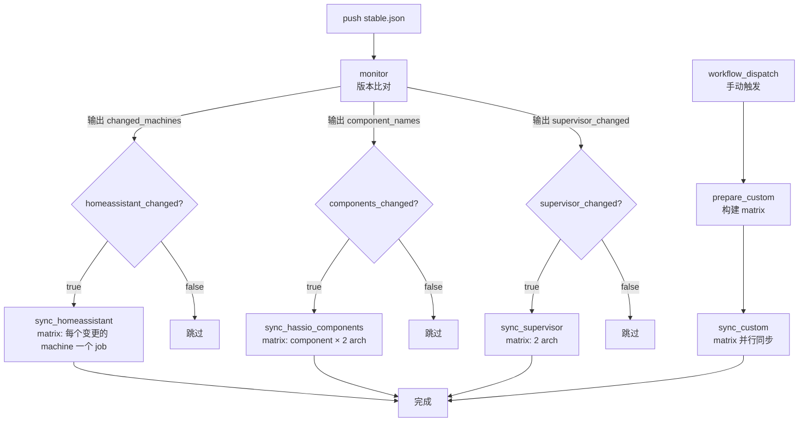

# Monitor and Sync Home Assistant Versions

本文档说明 [monitor-versions.yml](workflows/monitor-versions.yml) 工作流的工作原理、配置依赖与运维方式。

## 1. 概述

本工作流负责把 Home Assistant 相关镜像同步（retag + push）到国内镜像仓库，供国内用户拉取。

镜像来源分两类：

- **官方镜像**（HA 核心、HassIO 组件 cli/dns/audio/multicast/observer）：从 `ghcr.io/home-assistant/*` 拉。
- **自建镜像**（supervisor）：由 [supervisor 仓库](https://github.com/home-assistant-cn/supervisor) 基于官方源码自行构建（含中文化修改），推到 `ghcr.io/home-assistant-cn/*`，本工作流从这里拉。

**仅处理 `stable.json`**，不处理 `beta.json` / `dev.json`。当 `stable.json` 发生版本号变更时，工作流自动检测哪些组件发生了变化，只同步发生变化的镜像。

**设计目标**：

- **精准同步**：只同步实际发生版本变更的镜像，避免全量拉取/推送。
- **per-machine 版本感知**：`stable.json` 中每个 machine 可独立 pin 版本号（如 `qemux86` 可能落后于 `default`），工作流会逐个比对，不会用 `default` 版本覆盖那些 pin 在旧版的 machine。
- **失败可见**：镜像拉取/推送失败时工作流报红，不静默跳过。
- **并发安全**：同一分支多次推送不会互相踩踏。

## 2. 触发条件

```yaml
on:
  push:
    branches: ["master"]
    paths:
      - 'stable.json'
  workflow_dispatch:
    inputs:
      custom_target:
        description: '同步目标'
        type: choice
        options: [homeassistant, cli, dns, audio, multicast, observer, supervisor]
        default: cli
      custom_version:
        description: '版本号（必填，如 2026.06.0）'
        type: string
        default: ''
```

| 触发方式 | 说明 |
|---|---|
| `push`（修改 `stable.json`） | 仅 `master` 分支且推送的 commit 包含 `stable.json` 变更时触发。修改其它文件或其它分支不触发。 |
| `workflow_dispatch` | 手动触发。选择目标 + 输入版本号，同步指定镜像。详见第 9 节。 |

> 注意：不监听 PR。直接 push 到默认分支才会触发。

## 3. 整体架构

工作流按触发方式分两条路径：

- **push 触发**：`monitor` 比对 stable.json 差异 → 按需运行三个自动同步 Job
- **手动触发**：只运行 `prepare_custom` + `sync_custom`，由用户指定镜像和版本号

共六个 Job：



六个 Job 的关系：

- **push 触发时**：`monitor` 比对版本 → `sync_homeassistant` / `sync_hassio_components` / `sync_supervisor` 三个同步 Job 并行执行（都 `needs: monitor`）。
- **手动触发时**：`prepare_custom` 读 stable.json 构建 matrix → `sync_custom` 按 matrix 并行同步（max-parallel 5）。`monitor` 及三个自动同步 Job 全部跳过。
- 任一同步 Job 内部使用 matrix 并发跑多个镜像，`max-parallel: 5`。

## 4. Job 详解

### 4.1 `monitor` —— 版本比对

**职责**：对比 `HEAD` 与 `HEAD^` 两个 commit 的 `stable.json`，输出哪些 machine / 组件的版本号发生了变化。

**关键步骤**：

1. `actions/checkout` 用 `fetch-depth: 2` 拉取最近两个 commit（需要历史才能拿到上一版）。
2. 读取当前版本：`CURRENT=$(cat stable.json)`
3. 读取上一版：`PREVIOUS=$(git show HEAD^:stable.json 2>/dev/null || echo '{}')`
   - 首次提交（无 `HEAD^`）时回退为 `{}`，等价于"所有字段都是新增"。
4. 用 `jq` 做两路比对（详见第 5 节）。

**输出**（供下游 Job 消费）：

| Output | 类型 | 说明 |
|---|---|---|
| `changed_machines` | JSON 数组 | `[{"machine":"default","version":"2026.8.1"}, ...]`，仅含发生变更的 machine |
| `homeassistant_changed` | `true`/`false` | 是否有任意 machine 变更 |
| `component_names` | JSON 数组 | `["cli","dns",...]`，仅含发生变更的组件名 |
| `components_changed` | `true`/`false` | 是否有任意组件变更 |
| `supervisor_changed` | `true`/`false` | supervisor 版本是否变更 |
| `new_supervisor_version` | 字符串 | 变更后的 supervisor 版本号（如 `2025.10.1`），未变更时为空 |

Job 结束时会用 `::notice::` 把变更列表（machines / components / supervisor）打到日志，便于排查。

### 4.2 `sync_homeassistant` —— 同步 HA 核心镜像

**触发条件**：`homeassistant_changed == 'true'`

**Matrix**：`include: ${{ fromJSON(needs.monitor.outputs.changed_machines) }}`
- 每个 matrix 条目带 `machine` 和 `version` 两个字段。
- 例如 `changed_machines` 含 2 个对象，就并发跑 2 个 job。

**镜像命名映射**：

| `machine` 值 | 上游镜像 | 目标镜像 |
|---|---|---|
| `default` | `ghcr.io/home-assistant/home-assistant` | `${CN_REGISTRY}/${CN_NAMESPACE}/home-assistant` |
| 其它（如 `raspberrypi4-64`） | `ghcr.io/home-assistant/<machine>-homeassistant` | `${CN_REGISTRY}/${CN_NAMESPACE}/<machine>-homeassistant` |

**标签策略**：

| 标签 | 适用范围 | 说明 |
|---|---|---|
| `<version>` | 所有 machine | 精确版本号，如 `2026.8.1` |
| `stable` | 所有 machine | 稳定通道滚动标签 |
| `latest` | 仅 `default`（generic 镜像） | 滚动指向最新同步的版本 |
| `YYYY.M` | 仅 `default` | 年.月滚动标签，如 `2026.8`，由 `awk -F.` 截取前两段 |

> `latest`/`YYYY.M` 只打在 generic `home-assistant` 镜像上；`stable` 对所有 machine 都打。

**单个 machine 的处理流程**：

```
docker pull (3 次重试)
  └─ 失败 → ::error:: + exit 1（job 报红）
  └─ 成功 → docker tag (version + stable [, default: latest + YYYY.M])
            → docker push (所有标签，失败 → ::error:: + exit 1)
            → docker rmi 清理源镜像
            → ::notice:: 成功
```

### 4.3 `sync_hassio_components` —— 同步 HassIO 组件

**触发条件**：`components_changed == 'true'`

**Matrix**：`arch × component` 笛卡尔积
- `arch`: `['amd64', 'aarch64']`（官方已停更 `i386`/`armhf`/`armv7`，不再同步）
- `component`: 来自 `component_names`，仅含变更的组件（如 `["cli"]`）

**组件与镜像命名**：

| 组件 | 上游镜像 | 对应 stable.json 字段 |
|---|---|---|
| `cli` | `ghcr.io/home-assistant/<arch>-hassio-cli` | `.cli` |
| `dns` | `ghcr.io/home-assistant/<arch>-hassio-dns` | `.dns` |
| `audio` | `ghcr.io/home-assistant/<arch>-hassio-audio` | `.audio` |
| `multicast` | `ghcr.io/home-assistant/<arch>-hassio-multicast` | `.multicast` |
| `observer` | `ghcr.io/home-assistant/<arch>-hassio-observer` | `.observer` |

**版本读取**：组件版本是顶层的单一字符串（不区分 arch），在 `get_version` 步骤里用 `jq -r --arg c "$component" '.[$c]' stable.json` 直接读取，并校验非空。

**标签策略**：每个组件镜像打 `<version>` 和 `latest` 两个标签（无 `stable`/`YYYY.M`）。

**处理流程**：与 `sync_homeassistant` 一致（pull 重试 → tag → push）。

### 4.4 `sync_supervisor` —— 同步自构建 supervisor

**触发条件**：`supervisor_changed == 'true'`

**背景**：supervisor 与上述镜像不同——它不是官方镜像，而是由 [supervisor 仓库](https://github.com/home-assistant-cn/supervisor) 基于官方源码自行构建（含中文化修改）后推到 `ghcr.io/home-assistant-cn/<arch>-hassio-supervisor`。本工作流从这里拉取并同步到国内。

**Matrix**：`arch: ['amd64', 'aarch64']`（与 supervisor 构建矩阵一致）。

**镜像命名**：

| 项 | 值 |
|---|---|
| 源镜像 | `ghcr.io/home-assistant-cn/<arch>-hassio-supervisor`（public，无需登录 ghcr） |
| 目标镜像 | `${CN_REGISTRY}/${CN_NAMESPACE}/<arch>-hassio-supervisor` |

**版本来源**：stable.json 顶层 `.supervisor` 字段（单一字符串，全 arch 共用）。

**标签策略**：`<version>` + `latest`。

**时序保证**：supervisor 仓库的 [builder.yml](https://github.com/home-assistant-cn/supervisor/blob/main/.github/workflows/builder.yml) 执行顺序为 `manifest（推 ghcr）→ run_supervisor（测试）→ version（更新 stable.json）`。因此当本工作流因 stable.json 变更触发时，ghcr 上的 supervisor 镜像必然已就绪。

**处理流程**：与 `sync_homeassistant` 一致（pull 重试 → tag → push）。

### 4.5 `prepare_custom` + `sync_custom` —— 自定义镜像同步（仅手动触发）

**触发条件**：`workflow_dispatch`

**用途**：手动指定目标 + 版本号进行同步，不走版本比对。适用于补推某个特定版本、修复标签等灾备场景。

**输入参数**：

| 参数 | 说明 |
|---|---|
| `custom_target` | 同步目标：`homeassistant` / `cli` / `dns` / `audio` / `multicast` / `observer` / `supervisor` |
| `custom_version` | 版本号（必填，如 `2026.06.0`，留空则报错不执行） |

**执行流程**：

1. `prepare_custom`：读 [stable.json](../stable.json)，根据 `custom_target` 构建 matrix：
   - `homeassistant`：每个 machine 一个 matrix 条目（共 23 个）
   - 组件/supervisor：每个 arch 一个 matrix 条目（amd64 + aarch64）
2. `sync_custom`：按 matrix 并行同步（`max-parallel: 5`），每个条目一个独立 job。

**镜像命名与标签策略**：与自动同步 Job 完全一致——

| 目标 | 源镜像 | 标签 |
|---|---|---|
| `homeassistant` (default) | `ghcr.io/home-assistant/home-assistant` | version + stable + latest + YYYY.M |
| `homeassistant` (其它 machine) | `ghcr.io/home-assistant/<machine>-homeassistant` | version + stable |
| `cli`/`dns`/`audio`/`multicast`/`observer` | `ghcr.io/home-assistant/<arch>-hassio-<component>` | version + latest |
| `supervisor` | `ghcr.io/home-assistant-cn/<arch>-hassio-supervisor` | version + latest |

**pull 失败处理**：
- `homeassistant`：拉不到的 machine 跳过（`::warning::`），继续推下一个（部分 machine 可能 pin 在旧版，上游没有用户输入的版本号）。
- 组件/supervisor：pull 失败直接 `::error::` + `exit 1`（版本号明确，拉不到是异常）。

**与自动同步互斥**：手动触发时 `monitor` 及三个自动同步 Job 全部跳过（`monitor` 的 `if` 为 `github.event_name == 'push'`），只跑 `prepare_custom` + `sync_custom`。

## 5. 版本检测逻辑（核心）

### 5.1 HA per-machine 比对

[stable.json](../stable.json) 的 `homeassistant` 对象为每个 machine 单独 pin 版本号：

```json
"homeassistant": {
  "default": "2026.8.1",
  "qemux86": "2025.11.3",      // 落后于 default
  "qemux86-64": "2026.8.1",
  "raspberrypi": "2025.11.3",  // 落后于 default
  ...
}
```

比对逻辑（`jq -nc`）：

```jq
($cur.homeassistant // {}) as $c
| ($prev.homeassistant // {}) as $p
| $c | to_entries
| map(select(
    (.value | type) == "string"
    and .value != ""
    and .value != ($p[.key] // null)   # 与上一版不同
  )
  | {machine: .key, version: .value}
)
```

**示例**：default 与 qemux86-64 从 `2026.8.0` 升到 `2026.8.1`，qemux86 仍 pin `2025.11.3` 不变。

输出：

```json
[
  {"machine":"default","version":"2026.8.1"},
  {"machine":"qemux86-64","version":"2026.8.1"}
]
```

→ 只同步这 2 个 machine，qemux86 不动。

### 5.2 组件比对

`cli` / `dns` / `audio` / `multicast` / `observer` 是顶层字符串字段，每个组件全 arch 共用一个版本号：

```jq
["cli","dns","audio","multicast","observer"] as $keys
| $keys | map(select(($cur[.] // null) != ($prev[.] // null) and ($cur[.] | type) == "string"))
```

输出变更组件名数组，如 `["cli"]`。

### 5.3 supervisor 比对

supervisor 是顶层字符串字段（`.supervisor`），单一版本号全 arch 共用。比对逻辑直接取当前与上一版的值做字符串比较：

```bash
CURRENT_SUPERVISOR=$(jq -r '.supervisor // empty' <<< "$CURRENT")
PREVIOUS_SUPERVISOR=$(jq -r '.supervisor // empty' <<< "$PREVIOUS")
if [ -n "$CURRENT_SUPERVISOR" ] && [ "$CURRENT_SUPERVISOR" != "$PREVIOUS_SUPERVISOR" ]; then
  SUPERVISOR_CHANGED=true
  NEW_SUPERVISOR="$CURRENT_SUPERVISOR"
fi
```

- 用 `// empty` 处理字段缺失（首次提交或上一版无该字段）→ 返回空字符串 → 触发同步。
- 与组件比对不同，supervisor 单独处理而非纳入 `component_names`，因为它的**源镜像命名空间不同**（`ghcr.io/home-assistant-cn/` vs 官方 `ghcr.io/home-assistant/`）。

### 5.4 重要实现细节：`jq -n` 标志

所有比对 jq 调用都带 `-n`（null input）标志。**原因**：jq 表达式只通过 `--argjson` 注入数据，不读取 stdin；若不加 `-n`，jq 会等待 stdin，在无 stdin 的 CI 环境下静默输出空字符串，导致 matrix 为空、所有同步被跳过（且 workflow 显示绿色）。这是一个容易踩的坑。

## 6. 配置依赖

### 6.1 Secrets（仓库级）

| Secret 名 | 用途 | 必需 |
|---|---|---|
| `CN_REGISTRY` | 国内镜像仓库地址（如 `registry.example.com`） | ✅ |
| `CN_REGISTRY_SPACE` | 仓库命名空间/项目名 | ✅ |
| `CN_REGISTRY_USERNAME` | 仓库登录用户名 | ✅ |
| `CN_REGISTRY_PASSWORD` | 仓库登录密码/Token | ✅ |

> ⚠️ `CN_REGISTRY_PASSWORD` 应使用最小权限的推送专用凭据，避免使用可读写的全局账号密码。

### 6.2 环境变量

```yaml
env:
  CN_REGISTRY: ${{ secrets.CN_REGISTRY }}
  CN_NAMESPACE: ${{ secrets.CN_REGISTRY_SPACE }}
```

两个值从 secret 注入为 env，所有 Job 共享。

### 6.3 权限

```yaml
permissions:
  contents: read
```

本工作流只需读仓库（拉 `stable.json`），无需写仓库或 GitHub Package 权限。镜像推送走外部 registry，不依赖 `GITHUB_TOKEN`。

## 7. 失败处理与重试

### 7.1 docker pull 重试

每个镜像拉取最多重试 2 次，每次间隔 3 秒。使用 `--platform` 参数指定目标架构（GitHub Actions runner 默认 `linux/amd64`，拉取 arm64 镜像时必须指定，否则报 `no matching manifest for linux/amd64`）：

```bash
for i in 1 2; do
  if docker pull --platform "$platform" "${SRC_IMAGE}:${version}"; then
    pull_ok=true; break
  fi
  echo "::warning::Pull attempt ${i} failed, retrying in 3s"
  sleep 3
done
if [ "$pull_ok" != "true" ]; then
  echo "::error::Image not found after retries"
  exit 1
fi
```

2 次全部失败 → `::error::` + `exit 1`，该 matrix job 报红。镜像本应存在（版本刚变更），拉不到说明有异常。

> 注意：**不再静默跳过**。旧版用 `exit 0` 会让 workflow 假绿，导致镜像长期未同步却无人察觉。

### 7.2 matrix 隔离（`fail-fast: false`）

```yaml
strategy:
  fail-fast: false
  max-parallel: 5
```

- `fail-fast: false`：单个 machine/组件失败**不会取消**其它正在跑或排队的 job。
- `max-parallel: 5`：最多 5 个 job 同时跑，避免瞬时压垮 registry。

### 7.3 docker push 失败

所有同步 Job 统一用 `tags` 数组 + `for` 循环推送所有标签，每个标签 push 失败后自动重试 1 次（间隔 3s），两次都失败才打印 `::error::` 并退出非 0：

```bash
for tag in "${tags[@]}"; do
  docker tag "${SRC_IMAGE}:${version}" "${DEST_IMAGE}:${tag}"
  if ! docker push "${DEST_IMAGE}:${tag}"; then
    sleep 3
    if ! docker push "${DEST_IMAGE}:${tag}"; then
      echo "::error::Failed to push ${DEST_IMAGE}:${tag}"
      exit 1
    fi
  fi
done
```

## 8. 并发控制

```yaml
concurrency:
  group: monitor-versions-${{ github.ref }}
  cancel-in-progress: false
```

- 同一分支（`github.ref`）的多次推送归为同一组。
- `cancel-in-progress: false`：**不取消**正在进行的同步，新触发的会排队等当前完成后再跑。
- 避免两次推送并发对同一 `latest`/`stable` 标签产生 race。

## 9. 手动触发

在 GitHub 仓库 → **Actions** → 选择 **"Monitor and Sync Home Assistant Versions"** → **Run workflow** 即可手动触发。

手动触发时只需选择目标 + 输入版本号，不走版本比对：

| 参数 | 说明 |
|---|---|
| `custom_target` | 同步目标：`homeassistant` / `cli` / `dns` / `audio` / `multicast` / `observer` / `supervisor` |
| `custom_version` | 版本号（**必填**，如 `2026.06.0`，留空则报错不执行） |

> **注意**：手动触发 `homeassistant` 目标会遍历 stable.json 里所有 machine，用用户输入的版本号推送。拉不到的 machine（如 pin 在旧版的 32 位 machine）会跳过，不影响其它 machine。

**典型场景**：

- 国内仓库某个镜像标签丢了/坏了 → 选 `custom_target` + 输入版本号，只重推那一个。
- 某个组件需要回滚到旧版 → 选 `custom_target=cli` + 输入旧版本号，覆盖 `latest`。
- 补推所有 HA machine → 选 `custom_target=homeassistant` + 版本号。

## 10. 本地调试

### 10.1 验证 jq 比对逻辑

无需 push，本地即可模拟 monitor job：

```bash
cd /path/to/version
CURRENT=$(cat stable.json)
# 模拟上一版：把 default 改成旧版本
PREVIOUS=$(echo "$CURRENT" | jq '.homeassistant.default="2026.8.0" | .cli="2026.05.0"')

# 模拟 per-machine 比对
jq -nc '($cur.homeassistant // {}) as $c | ($prev.homeassistant // {}) as $p
  | $c | to_entries
  | map(select((.value|type)=="string" and .value!="" and .value!=($p[.key]//null))
      | {machine:.key,version:.value})' \
  --argjson cur "$CURRENT" --argjson prev "$PREVIOUS"
```

期望输出仅含实际变更的 machine。

### 10.2 验证 YAML 语法

```bash
# 需要 pyyaml 或 ruby
python3 -c "import yaml; yaml.safe_load(open('.github/workflows/monitor-versions.yml')); print('OK')"
```

### 10.3 检查上游镜像是否存在

```bash
# 例：检查某个 machine 的某个版本是否已发布
docker manifest inspect ghcr.io/home-assistant/raspberrypi4-64-homeassistant:2026.8.1 >/dev/null && echo "exists" || echo "missing"
```

## 11. 常见问题（FAQ）

**Q1：为什么 `qemux86` / `raspberrypi` 这些 machine 的版本号比 `default` 旧？**

A：上游对部分 32 位/老平台停止发布新版（如 32 位 x86 停更），`stable.json` 把这些 machine pin 在最后一个可用版本。本工作流尊重这种 pin：只有当某个 machine 的值**实际发生变化**时才同步它，不会用 `default` 版本去覆盖。

**Q2：某次同步后 `monitor` 显示无变更，但我期望它同步。**

A：检查 `monitor` job 的 `::notice::` 输出。如果变更列表为空，说明 `stable.json` 与上一版 commit 相比确实没变（可能改动没被提交，或改动的是 `hassos` 等本工作流不监控的字段）。本工作流监控的字段：`homeassistant.*`（per-machine）、`cli`、`dns`、`audio`、`multicast`、`observer`、`supervisor`。

**Q3：matrix 里为什么没有 `amd64-homeassistant` 这类 arch 前缀镜像？**

A：上游 HA 核心镜像按 **machine** 命名（`<machine>-homeassistant`），不按 arch 命名。arch 前缀（`amd64-`、`aarch64-` 等）只用于 HassIO 组件镜像（`<arch>-hassio-cli`）。`amd64-homeassistant` 这类镜像上游不发布，旧版 workflow 把它们列在 matrix 里每次都会 pull 失败、静默跳过，纯属无效负载，已移除。

**Q4：为什么用 SHA 固定 Action 而不用 `@v4`？**

A：`@v4` 是移动标签，可能被恶意覆盖（供应链攻击风险）。SHA 固定指向不可变 commit，与本项目 [version.yml](workflows/version.yml) 的安全实践一致。注释里保留了版本号便于追踪升级。

**Q5：可以同时处理 `beta.json` / `dev.json` 吗？**

A：当前设计**不处理**。如需同步 beta/dev，建议单独建一个工作流文件（如 `monitor-versions-beta.yml`），避免把多 channel 逻辑塞进同一份 YAML 增加复杂度。

**Q6：`workflow_dispatch` 手动触发有哪些模式？**

A：手动触发只支持一种模式——选择目标 + 输入版本号（`custom_target` + `custom_version`），同步指定的单个镜像。不走 stable.json 版本比对，版本号由用户输入，留空则报错不执行。详见 §4.5。

**Q7：为什么 `sync_hassio_components` 的 arch 只剩 `amd64` 和 `aarch64`？**

A：Home Assistant 官方已停止对 32 位架构（`i386`、`armhf`、`armv7`）的维护与镜像发布。保留这些 arch 会导致每次同步都 `docker pull` 失败、matrix job 报红，因此从 arch matrix 中移除。已同步到国内 registry 的旧版本 32 位镜像仍保留可用，只是不再更新。如未来官方恢复支持，重新加回 arch 列表即可。

## 12. 相关文件

| 文件 | 作用 |
|---|---|
| [monitor-versions.yml](workflows/monitor-versions.yml) | 本工作流定义 |
| [stable.json](../stable.json) | 版本号源文件（监控对象） |
| [version.yml](workflows/version.yml) | 负责签名 + 上传 `stable.json` 等到 CDN，与本工作流互补 |
| [.github/dependabot.yml](dependabot.yml) | Action 版本依赖更新 |

## 13. 变更历史

| 日期 | 变更 |
|---|---|
| 2026-08-11 | 重构：per-machine 版本感知、移除无效 arch-prefixed 镜像、pull 重试 + 失败可见、SHA 固定 Action、增加 permissions/concurrency/workflow_dispatch、matrix 重构 |
| 2026-08-11 | 收窄 HassIO 组件 arch matrix：移除官方已停更的 `i386`/`armhf`/`armv7`，仅保留 `amd64`/`aarch64` |
| 2026-08-11 | 新增 `sync_supervisor` job：同步自构建 supervisor（源 `ghcr.io/home-assistant-cn/`，标签 version+latest） |
| 2026-08-11 | generic `home-assistant` 镜像增加 `beta`/`rc` 通道标签（国内兜底，指向 stable 构建） |
| 2026-08-11 | 调整 HA 标签策略：所有 machine 打 `version`+`stable`；`latest`/`beta`/`rc`/`YYYY.M` 收窄为仅 generic `home-assistant` |
| 2026-08-11 | 优化：push 触发限制 master 分支；移除 sync_homeassistant/sync_supervisor 多余 checkout；统一 push 失败处理为带 `::error::` 的循环 |
| 2026-08-11 | P2 加固：三个同步 job 加 `timeout-minutes: 30`；表达式注入加固（matrix/needs 值改用 `env:` 传递，run 块内零 `${{ }}`）；`workflow_dispatch` 增加 `force_full_sync` 全量同步选项（全量模式下 pull 失败跳过而非报错，适配 32 位停更镜像场景） |
| 2026-08-11 | 重构手动触发为三模式（`sync_mode`：incremental/full/custom）；新增 `sync_custom` Job 支持自定义单镜像同步（选择目标+版本号）；`force_full_sync` 统一为 `sync_mode=full` |
| 2026-08-11 | 简化 custom 模式：移除 `custom_arch` 参数，组件/supervisor 默认同步所有架构（amd64 + aarch64） |
| 2026-08-11 | `full` 模式增加 `full_sync_scope` 选项：可选 all/homeassistant/components/supervisor，支持只全量重推某一类镜像 |
| 2026-08-11 | 简化手动触发：去掉 incremental/full 模式，只保留 custom（选目标+输入版本号）；手动触发时版本号由用户输入，不走 stable.json 比对；去掉 sync_mode/full_sync_scope/force_full_sync 相关逻辑 |
| 2026-08-11 | 移除 `custom_machine` 参数：手动同步 homeassistant 只推 default（home-assistant 通用镜像），其它 machine 由 push 自动触发 |
| 2026-08-11 | 手动同步 homeassistant 改为遍历 stable.json 所有 machine：用用户输入的版本号推送所有 machine，拉不到的跳过继续 |
| 2026-08-12 | 性能优化：sync_custom 从单 job 串行改为 matrix 并行（prepare_custom 构建 matrix → sync_custom max-parallel 5）；pull 重试 3 次→2 次，sleep 5s→3s；去掉 docker rmi（runner 临时无需清理） |
| 2026-08-12 | 移除 `beta`/`rc` 标签：generic `home-assistant` 镜像标签精简为 version + stable + latest + YYYY.M |
| 2026-08-12 | 所有 `docker pull` 加 `--platform` 参数：修复 amd64 runner 拉取 aarch64 镜像报 `no matching manifest` 错误 |
| 2026-08-12 | docker push 加 1 次重试（间隔 3s）：网络抖动导致 push 失败时自动重试，减少不必要的 job 失败；sync_hassio_components/sync_supervisor tag/push 逻辑统一为 `tags` 数组模式 |
